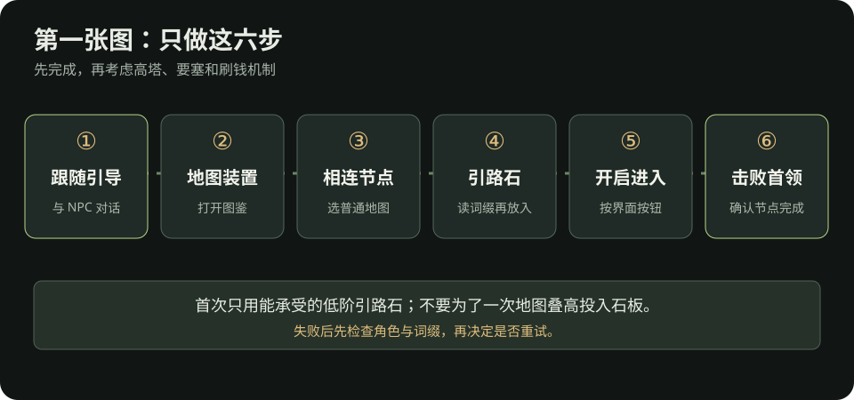

# 流放之路 2：战役结束到第一张图

> 这篇只解决“通关后怎样亲手打开并完成第一张异界地图”。适用于 0.5 系列；城镇布局和任务名称可能变化，实际按钮以当前游戏内异界引导为准。核对日期：2026-10-09。第一次开图不用研究整棵异界树，也不用投入昂贵石板。

## 开图前，先做五分钟整理

1. 打开[开荒奖励复查](开荒.md#入异界前复查)，确认任务物品已使用，升华点另外检查。没拿满不一定不能开图，但不要把明显遗漏的永久奖励当成装备问题。
2. 打开[角色面板](看懂角色面板.md#换装前后怎么比较)：主技能能用，火冰闪抗性没有明显短板，生命／能量护盾和药剂足以支撑当前战斗。此处没有全流派通用的“合格数值”；用实际战斗验证。
3. 整理背包，留出捡通货、引路石和可能自用装备的空间。过滤器先用宽松设置；如果还不会安装，照[过滤器三步](装备交易.md#第一次启用物品过滤器)操作。
4. 先准备一枚能使用的低阶**引路石（Waystone）**。跟随游戏内异界引导与相关 NPC 对话，检查任务奖励、背包和仓库；若仍没有，先查[缺引路石排查](卡关排查.md#进异界后没有引路石)。

## 六步完成第一张图

*教学示意图：路线是“异界引导 → 地图装置 → 相连节点 → 引路石 → 开门进入 → 击败地图首领”。这是操作关系图，界面布局以游戏内为准。*

| 步骤 | 在游戏里做什么 | 怎样确认 |
| --- | --- | --- |
| 1. 找引导 | 战役结束后跟任务到异界据点，与任务指向的 NPC 对话。 | 任务文字开始指向地图装置／异界。 |
| 2. 找地图装置 | 在异界据点找到地图装置并互动；首次使用应显示异界图鉴。 | 能看到起点和与起点相连的可选节点。 |
| 3. 选相连节点 | 先选从起点可到达的普通地图，不绕远路追高塔或特殊图标。 | 节点打开了放置引路石的界面。 |
| 4. 放引路石 | 把低阶引路石放入对应槽位，先读等阶、词缀和显示的复活机会；第一次不叠昂贵石板。 | 开启按钮可用，词缀没有明显克制你的角色。 |
| 5. 开门并进入 | 按界面上的“开启／前往”（Traverse）按钮，从地图装置出现的传送门进入。 | 角色进入新地图，任务继续更新。 |
| 6. 清图并打首领 | 清普通怪、找地图首领并击败；拾取引路石、通货和可能自用的装备。 | 异界节点显示完成，能继续走到相邻地图。 |

首次地图装置通常位于**金字塔避难所（The Ziggurat Refuge）**一带，之后也可能在自己的藏身处使用。若地点或名称与本文不同，沿当前主线任务标记找装置，不要照旧版攻略的城镇路线硬走。[地图装置资料](https://www.poe2wiki.net/wiki/Map_Device)

## 第一张图失败了怎么办

- **开不了门：**确认选的是已连接的节点、放入的是引路石而非石板，并检查异界引导任务是否需要先与 NPC 交互。
- **进图后伤害或生存不足：**先回[卡关排查](卡关排查.md)，换低难度内容补一件装备；不要把同样打不过的词缀连续重试。
- **首领找不到：**打开地图查看未探索区域和首领提示；不要只把地图上的普通怪清完就认为完成。
- **引路石用完：**回[缺引路石排查](卡关排查.md#进异界后没有引路石)，检查仓库、过滤器、商人与可稳定完成的低阶地图。

## 完成后只做三件事

- [ ] 把新掉落分成“自用装备／可卖材料／继续开图的引路石”，不要在地图里逐件查价。
- [ ] 用[看懂一件装备](看懂一件装备.md)和[角色面板](看懂角色面板.md)检查是否得到真正升级；没有也属正常。
- [ ] 按[异界路线](异界.md#第一阶段-从第一张图到第一座先驱高塔)继续走已解锁的相邻节点，并在前十张图里记录装备短板。

第一次完成地图，目标是学会开图与活着打完；稳定刷装备的循环见[前十张图装备升级计划](异界.md#前十张图-建立装备升级循环)。

## 资料

- [PoE2 Wiki：地图装置](https://www.poe2wiki.net/wiki/Map_Device)、[引路石](https://www.poe2wiki.net/wiki/Waystone)、[异界图鉴](https://www.poe2wiki.net/wiki/Atlas)：开图界面、节点和完成方式。
- [GGG 官方 0.5.0 更新说明](https://www.pathofexile.com/forum/view-thread/3932540)：高塔、要塞与异界任务结构的版本依据。
