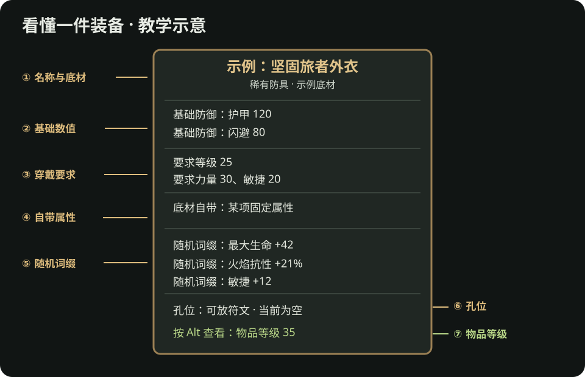

# 流放之路 2：看懂一件装备

> 看见满屏数字不知道该不该穿？先学会读一件物品，再决定[捡、买还是做](装备交易.md#这次升级该捡-买还是做)。下面的图是**教学示意**，不是某件真实可掉落装备；词缀、数值、孔位和界面布局以游戏内当前版本为准。

*示意图：从上到下依次找名称与底材、基础防御／伤害、装备要求、自带属性、随机词缀、孔位，以及按 Alt 显示的物品等级。具体数字只为演示读法。*

## 先读七个位置

| 位置 | 你在找什么 | 为什么重要 |
| --- | --- | --- |
| 名称、稀有度、底材 | 这是哪一类武器或防具；普通、魔法还是稀有 | 主技能可能要求指定武器类型；制作材料也有稀有度限制。 |
| 基础伤害或防御 | 这件底材本身提供什么 | 同类装备可先比较基础类型，再看词缀。 |
| 装备要求 | 需要多少等级和力量／敏捷／智慧 | 要求不满足就穿不上；换掉旧装备提供的属性，也可能让技能变灰。 |
| 自带属性 | 底材本身带的属性 | 它与随机词缀不同，普通通货未必能把它“洗”成想要的属性。 |
| 随机词缀 | 生命、抗性、伤害、技能等级等 | 判断是否解决你当前的伤害或生存短板。 |
| 孔位与镶嵌物 | 可放的符文等材料，以及已放入的效果 | 别把孔位效果误认成普通随机词缀；使用前看能否更换。 |
| 物品等级 | 鼠标悬停时按 Alt 查看，或按平台的详细信息提示 | 它影响可出现的词缀范围，**不是**角色穿上它所需的等级。 |

**一个常见误读：**“要求等级 25”只说角色什么时候能穿；“物品等级 35”用于判断这件物品可出现的词缀范围。这两个数字不等于装备好坏。战役中一件要求低、词缀合适的装备，可能比高物品等级空白底材更实用。

## 用一件防具练习比较

假设旧防具给你火抗和必要的敏捷，新防具给更多生命，但没有敏捷。不要只看“生命 +多少”：先把新防具穿上，打开[角色面板](看懂角色面板.md#换装前后怎么比较)，看火抗与生命的实际变化，再确认主技能没有因敏捷不足而失效。若新装备让一个关键条件失效，它目前就不是直接升级。

**前期判断顺序：**能穿 → 技能能用 → 补最明显短板 → 看整体防御或伤害 → 再考虑制作和售价。武器也一样：攻击技能、法术和召唤技能使用武器属性的方式不同，不能只凭武器提示框最上方的数字判断。[新手做装备](新手做装备.md#实例二-做一把能提升主技能的过渡武器)有武器实例。

## 什么值得留下，什么先不用研究

- **先留意：**适合主技能的武器类型、当前缺的抗性或生存属性、你已经在使用的制作材料和任务物品。
- **先不用深究：**不认识的昂贵特殊词缀、每一个词缀等级、所有后期底材。你可以把少量疑似有价值的装备放在待查价页，集中比较。
- **准备交易或制作时再查：**具体词缀能否出现在该部位、物品等级是否足够，以及同联盟成品报价。[交易站](https://www.pathofexile.com/trade2)和[流放2编年史](https://poe2db.tw/cn/)适合回答这两个问题。

## 读懂后去哪里

- 想知道新装备穿上后角色实际发生了什么：去[看懂角色面板](看懂角色面板.md)。
- 想决定这次升级是捡、买还是做：去[装备与交易](装备交易.md#这次升级该捡-买还是做)。
- 想用手中底材与通货做一件：去[新手做装备](新手做装备.md#第一步-选对底材)。

## 资料

- [PoE2 Wiki：物品等级](https://www.poe2wiki.net/wiki/Level)、[物品](https://www.poe2wiki.net/wiki/Item)：物品等级、装备要求与物品类型。
- [PoE2 Wiki：词缀](https://www.poe2wiki.net/wiki/Modifiers)、[制作](https://www.poe2wiki.net/wiki/Crafting)：自带属性、随机词缀和孔位的概念；版本敏感细节以游戏内说明为准。
