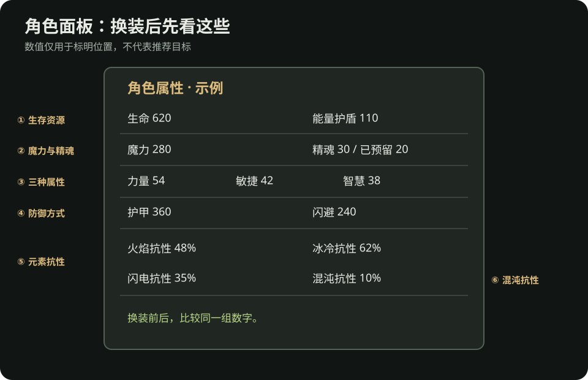

# 流放之路 2：看懂角色面板

> 这页只解决一个问题：换装备、升级技能后，角色**实际上**有没有更稳、更能打。角色面板的位置和数值显示随平台与版本可能不同；下图是教学示意，不是游戏截图。

*示意图：先找生命／能量护盾、魔力、精魂、力量／敏捷／智慧、防御方式、火冰闪抗性。示例数值只为教学。*

## 新手先看这六处

| 区域 | 读法 | 什么时候回来看 |
| --- | --- | --- |
| 生命与能量护盾 | 两者都是生存相关资源，但角色如何恢复与依赖它们，要看自己的技能和装备。 | 换防具、突然更容易死时。 |
| 魔力 | 主技能能否持续使用；药剂与回复能否跟上。 | 技能升级或装上辅助后消耗明显变高时。 |
| 精魂 | 看总额与已预留量；持续技能开启不了时先查这里。 | 获得精魂奖励、换持续技能或装备时。 |
| 力量／敏捷／智慧 | 装备和技能的使用条件。 | 换下提供属性的装备，或升级宝石后。 |
| 护甲／闪避等防御 | 它们处理不同类型的威胁；别只挑一个看起来最高的百分比。 | 同一类怪总能击倒你时，结合实际死因检查。 |
| 火、冰、闪抗性 | 看**角色面板的实际数值**，而不是把装备上的词缀自己相加。混沌抗性单独显示。 | 每进新章节、换装备、进入异界前。 |

战役推进过程中元素抗性会受到惩罚。某件装备写着“火焰抗性 +X%”，不代表角色面板的火抗就是 X%；要以面板显示为准。抗性通常有上限，初期先补明显偏低的一项，不必为了单一数值牺牲全部技能要求与生存属性。

## 换装前后怎么比较

1. **换之前：**记下火冰闪抗性、生命／能量护盾、关键属性，以及主技能能否使用。
2. **换之后：**再看同样几项。新装备让生命增加，却使火抗大幅下降或技能变灰，就还不能算直接升级。
3. **进战斗验证：**回原本能完成的同类区域打一轮，观察清怪、首领和死亡情况；角色面板的技能数字不能替代实战。

**例子：**换一件戒指后生命变高，但原戒指给的敏捷消失，主技能灰掉。先换回旧戒指，再在其他部位补敏捷，或到[装备与交易](装备交易.md#这次升级该捡-买还是做)找兼顾需求的替代品。不要因为新戒指有更多生命就继续穿着不能用技能的配置。

## 哪个症状先看哪里

| 症状 | 先看面板 | 再去读 |
| --- | --- | --- |
| 被元素伤害频繁击倒 | 对应元素抗性、生命／能量护盾 | [卡关排查](卡关排查.md#经常突然死亡) |
| 技能灰掉 | 属性、所穿武器、技能要求 | [技能排查](卡关排查.md#技能用不了或资源不够) |
| 持续技能无法开启 | 精魂总额与预留 | [开荒精魂奖励](开荒.md#入异界前复查) |
| 主技能很快耗尽魔力 | 魔力、消耗与回复 | [技能排查](卡关排查.md#技能用不了或资源不够) |

## 资料

- [PoE2 Wiki：抗性](https://www.poe2wiki.net/wiki/Resistance)、[精魂](https://www.poe2wiki.net/wiki/Spirit)：角色面板对应数值及战役变化。
- [PoE2 Wiki：属性](https://www.poe2wiki.net/wiki/Attribute)、[生命](https://www.poe2wiki.net/wiki/Life)、[能量护盾](https://www.poe2wiki.net/wiki/Energy_shield)：装备与技能要求、生存资源的基本概念。
