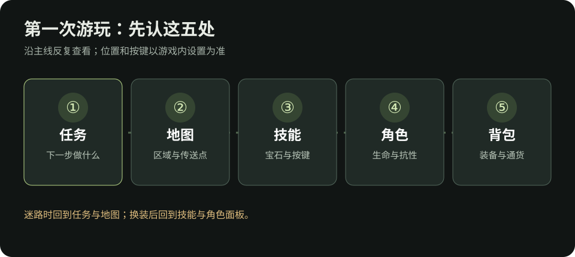

# 流放之路 2：第一次游玩的前 60 分钟

> 完全没玩过？从这里开始。时间只是节奏参考，不是限时任务。界面名称和位置可能随版本、平台变化；找不到按钮时以游戏内提示和设置中的按键说明为准。核对日期：2026-10-09。

## 建角时先做两个选择

1. **联盟：**想和其他玩家交易、照着本 Wiki 的买卖步骤学习，选择当前普通交易联盟。单人自力（SSF）无法与玩家交易，适合想完全靠自己掉落和制作装备的人；硬核模式有额外死亡限制。第一次玩、还不确定时，普通交易联盟通常更容易按本文流程求助和补装备。
2. **职业：**先选你愿意持续玩的技能风格。职业决定天赋树起点和可选升华，但开局不用找“全游戏最强职业”。如果已有喜欢的技能，按[工具与 BD 学习](工具与BD.md#我想玩一个技能-但不知道选什么职业)反查常见职业。

创建角色后，先打开**设置 → 操作／按键**，认出角色面板、技能、背包、任务和地图各自的入口。键鼠与手柄的按键不同，本页只写要打开的界面。

*示意图：按任务走时常回看“任务、技能、角色、背包、地图”五处；这不是游戏截图，实际位置以当前客户端为准。*

## 0～15 分钟：跟任务走，先让一个技能能用

- 跟随当前主线任务标记前进，沿路激活遇到的传送点。地图上的未探索区域和任务目标比“把每个角落搜完”更重要。
- 拿到**未切割技能宝石**时，按说明刻印一种当前能使用的技能；在技能界面装备它，并把它放到顺手的按键。使用时若变灰，先看武器类型、属性、等级与资源要求。
- 拿到辅助宝石后，把它放入想加强的技能插槽，再看技能面板是否显示生效。辅助宝石只影响它所连接的技能；不要只因说明写“提高伤害”就认为一定适用。
- 学会闪避与使用生命／魔力药剂。第一次打首领，先观察地面提示和攻击前动作，再找安全间隙输出。

**现在的完成标准：**能指出主要输出技能、它使用的武器，以及战斗中缺的是生命还是魔力。还不需要确定最终 BD。

### 第一次装技能，照这个顺序点

1. 打开背包，找到“未切割技能宝石”，按物品说明打开刻印界面。选一个与你目前武器、属性要求相符的技能；刻印前先读技能标签与要求。
2. 打开技能界面，把得到的技能宝石放入可用技能位置；再按界面提示把它分配到顺手的操作键。键鼠与手柄的按法不同，照当前客户端屏幕提示操作。
3. 到安全的普通怪旁试用一次。能施放且魔力能维持，才继续装辅助宝石；辅助宝石要进入这项技能自己的插槽，并检查它没有显示为失效。
4. 如果按键没有反应，先在技能界面确认**已装备、已分配按键、武器匹配、属性足够**，再去[技能排查](卡关排查.md#技能用不了或资源不够)。

*认图：技能和辅助宝石在技能界面管理，装备与未切割宝石在背包里查看。截图来自旧版本，图标和位置以当前客户端为准。图片来源：[Deltia's Gaming 职业指南](https://deltiasgaming.com/a-comprehensive-guide-about-the-ranger-class-in-path-of-exile-2/)。*

## 15～40 分钟：第一次回城，整理四样东西

| 打开哪里 | 只检查什么 | 下一步 |
| --- | --- | --- |
| 任务与地图 | 主线目标、传送点、可能的奖励图标 | 不知道去哪里时先看任务文字，再找地图标记。 |
| 技能 | 主技能是否能用、辅助是否装对、消耗是否负担得起 | 灰掉或缺资源时查[卡关排查](卡关排查.md#技能用不了或资源不够)。 |
| 角色面板 | 生命、魔力、精魂、火冰闪抗性 | 先认识位置；具体读法看[看懂角色面板](看懂角色面板.md)。 |
| 背包与商人 | 武器类型、要求等级、生命和抗性 | 不必捡所有黄装；需要比较时看[看懂一件装备](看懂一件装备.md)。 |

**金币与通货要分开：**金币常用于商人和部分游戏内服务；蜕变石、富豪石等通货既能改造物品，也可能用于交易。不要因为背包里有某种通货，就立即把它用在第一件掉落上。装备值不值得投入，先看[新手做装备](新手做装备.md#先决定-捡-买-还是自己做)。

## 40～60 分钟：建立每章都能重复的习惯

1. **接任务 → 开传送点 → 完成目标 → 领取奖励。**击败首领后，留意任务是否还要求拾取、使用物品或与 NPC 对话；[开荒奖励清单](开荒.md)可查容易漏掉的永久奖励。
2. **每次换装看角色面板。**装备上一件新武器或防具后，检查技能是否可用、生命／能量护盾和实际抗性是否变化。若数字变差，换回旧装备再比较。
3. **只解决当前最明显的问题。**清怪慢先查技能与武器；经常死先查抗性和防御；迷路先看任务与地图。别同时重做技能、天赋和整套装备。

## 找不到任务地点时

先读任务文字里的**章节、区域和 NPC 名称**，再打开世界地图找对应区域与传送点。传送到区域后再看该区域的局部地图；局部道路和首领位置可能随实例变化。完成目标后，如果任务没有结束，检查地上的任务物品、背包里的可使用奖励，以及城镇里是否有交任务的 NPC。找永久奖励可直接按[开荒篇的章节表](开荒.md)定位。

若任务标记仍不清楚，记录任务名称和当前区域，再按[求助信息模板](卡关排查.md#最短求助信息模板)提问，比只说“我迷路了”更容易得到准确路线。

## 前 60 分钟结束时的检查

- [ ] 我知道如何打开任务、地图、技能、角色和背包界面。
- [ ] 我能使用至少一个主输出技能，知道对应武器要求。
- [ ] 我知道换装备后要复查技能、生命与抗性。
- [ ] 我知道金币和改造装备的通货用途不同。
- [ ] 我会按任务推进，不要求自己在第一小时学会整棵天赋树。

接下来按[新手起步路线](新手起步.md)继续推战役；遇到装备词缀看不懂时先读[看懂一件装备](看懂一件装备.md)，要查角色是否变强就读[看懂角色面板](看懂角色面板.md)。

想认识社区常说的“BD、满抗、刷图、E、D”，随时打开[名词与黑话对照](名词与黑话.md)；想给自己留一点探索空间，可看[游玩乐趣与避雷](游玩乐趣与避雷.md)。

## 资料

- [PoE2 Wiki：技能宝石](https://www.poe2wiki.net/wiki/Gem)、[未切割辅助宝石](https://www.poe2wiki.net/wiki/Uncut_Support_Gem)：技能与辅助的基础用法。
- [PoE2 Wiki：单人自力模式](https://www.poe2wiki.net/wiki/Solo_Self_Found_Guide)：交易限制和模式差异。
- [GGG 官方 0.5.0 更新说明](https://www.pathofexile.com/forum/view-thread/3932540)：当前系列的游戏内 BD 指南和交易功能变化。
