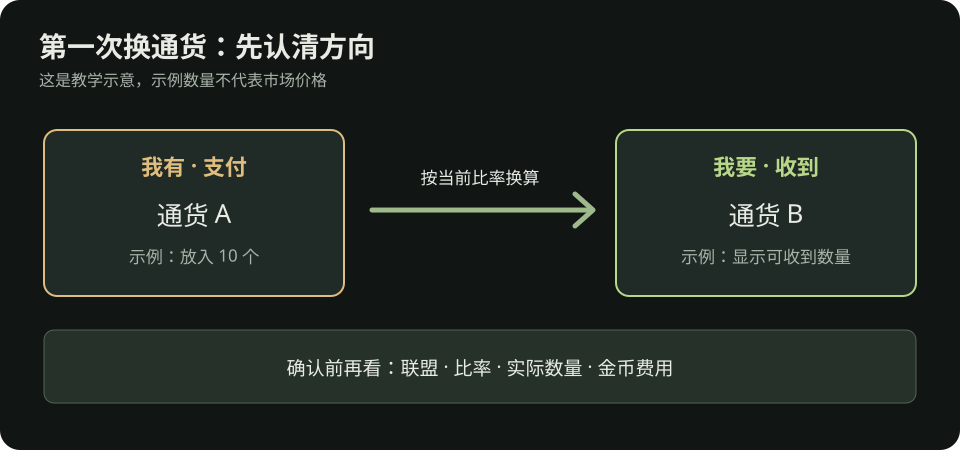

# 流放之路 2：装备、过滤器与第一次交易

> 给刚推战役或刚进入异界的交易联盟玩家。物价会变，本文不写固定汇率。单人自力玩家可以照着整理装备，但跳过交易步骤。

需要收藏交易站、poe.ninja、过滤器和 PoB2 的入口，可先看[外部工具与 BD 学习](工具与BD.md)。

装备文字还看不懂？先读[看懂一件装备](看懂一件装备.md)；想确认换装后的实际效果，按[角色面板的比较步骤](看懂角色面板.md#换装前后怎么比较)操作。

## 换装顺序：先解决最明显的短板

| 状况 | 先看哪里 | 优先尝试 |
| --- | --- | --- |
| 小怪清得慢 | 主技能、武器、技能等级 | 换适合的武器基础类型；核对辅助宝石是否生效 |
| 首领打很久 | 单体技能、武器与资源消耗 | 保证能持续输出；查看技能与首领弱点是否匹配 |
| 被元素伤害频繁击杀 | 角色面板的火、冰、闪抗性 | 找带对应抗性的防具、戒指或其他可用部位 |
| 被普通怪围住就倒 | 生命／能量护盾、护甲／闪避、回复 | 先补装备基础防御和生命，再看站位与控场 |
| 装上新装备后技能灰掉 | 属性、武器或技能条件 | 补所需属性，或换回可用的武器 |

**新手换装原则：**一件装备要看整体效果。买之前先比较装上后角色面板的抗性、生命／能量护盾与技能能否使用，不因为单个漂亮词缀就牺牲整套装备的平衡。

## 这次升级该捡、买还是做

| 手头情况 | 下一步 |
| --- | --- |
| 已捡到或在商人处看到能明显补短板的装备 | 先试穿并核对角色面板，不必额外投入。 |
| 有合适底材、缺一项常见属性、手里有少量材料 | 按[新手做装备](新手做装备.md)做一件够用的过渡装，达到目标就停。 |
| 需要多项指定属性，或下一步材料比同类成品还贵 | 去交易站比较成品；单人自力玩家先换底材或刷可稳定完成的内容。 |

做与买都先写清**目标、预算、停手条件**。不要把已经花掉的材料当成继续投入的理由。

**这页之后怎么走：**选“做”就打开[新手做装备](新手做装备.md)；选“买”就按下面的第一次购买清单操作；换完仍打不过，回[卡关排查](卡关排查.md)看具体症状。战役结束后先照[首图六步](战役结束到第一张图.md#六步完成第一张图)开图，再接[异界路线](异界.md)。

## 看到掉落时，如何决定捡不捡

1. **任务物品、通货、引路石与自己正在用的材料**先收好。
2. **与自己技能匹配的武器底材、防具底材**可以看一眼。高等级基础类型常能带来直接提升。
3. **黄装不必全捡。**包满时优先留可能自用或容易出售的物品；价值不明确的物品先放一个待查价页，不要让查价打断每张图。
4. **用物品过滤器减少地面噪声。**初期选不会隐藏常用通货、引路石和重要材料的宽松过滤器；随着进度再收紧。装好后在游戏设置中确认它已启用。

### 第一次启用物品过滤器

1. 打开[官方 PoE2 过滤器列表](https://www.pathofexile.com/item-filter/ladder/follower/type/PoE2)，确认类型是 **PoE2**，选一个标为普通或宽松的过滤器。第一次用不要选隐藏大量物品的严格版。
2. 用与你游戏角色相同的账号登录，打开过滤器详情并点 **Follow／关注**。键鼠、手柄和主机玩家都可按官方网页关注；如果游戏里看不到，先检查登录的是否为同一个账号。
3. 回游戏打开**设置 → 游戏／玩法 → 物品过滤器**，从列表中选刚关注的过滤器并确认。不同平台的菜单名称略有不同，以当前客户端为准。
4. 打一张容易完成的图验证：引路石、通货和自己需要的材料是否仍能看到，物品标签是否发生变化。若关键物品不见，先切回默认或更宽松的过滤器，再调整。

过滤器只改变地面物品的显示方式，不保证额外掉落。官方页面对“关注 → 在游戏设置中选择”的流程有[简要说明](https://www.pathofexile.com/item-filter/ladder/follower/type/PoE2)。

## 第一次购买：只买能改变体验的升级

- [ ] 明确问题：是伤害、生存、抗性，还是技能因属性不足而无法使用？
- [ ] 在[官方 PoE2 交易站](https://www.pathofexile.com/trade2)选择正确的联盟和物品类型，设置**必要条件**，先不要叠太多筛选词。
- [ ] 比较多个正在出售的相近物品，查看价格、要求等级与属性；预留其他部位补抗性的空间。
- [ ] 如果游戏内支持，也可以对手中物品按 **Shift + Alt + 点击**打开交易市场快捷搜索，再逐项开关稀有装备的词缀筛选。手柄操作按界面提示；快捷搜索给的是挂牌参考，仍需看相似物品和实际可成交价格。
- [ ] 交易前核对物品名称、词缀和实际支付的通货。交易窗口里的物品若变化，再看一遍。
- [ ] 装备后打开角色面板复查，再去打原来卡住的同类内容。

第一笔预算通常先补让角色**更稳定完成地图**的装备；如果已经能稳定完成，才考虑缩短清图时间或购买刷图投入品。

### 第一次买装备：从搜索到穿上

1. 先写一个**必须满足**的条件，例如“这件戒指至少帮我补当前最缺的元素抗性”；再写一个可放宽条件，例如生命。搜索时选正确联盟和部位，不要同时锁死太多词缀。
2. 打开几个相近挂牌，比较总价格、要求等级与属性。挂牌价不是保证成交价，特别低的孤例先不要当作市场价。
3. 按交易站或游戏内提示发起购买。进入交易确认时，逐项看物品类型、关键词缀、数量和支付通货；界面内容变化就重新核对。
4. 穿上后打开[角色面板](看懂角色面板.md#换装前后怎么比较)，检查实际抗性、生命和技能是否可用。没达到原目标，就别马上买第二件，先看是哪一项判断错了。

交易方式会随联盟和游戏版本变化；具体入口按官方交易站和游戏内提示操作，不需要背旧攻略里的固定按键。

## 第一次出售：区分装备与材料

**装备：**用官方交易站查看相近物品的标价，但挂价不等于成交价。若只有一个很低的报价或样本很少，不要据此判断市场价。先从少量你看得懂词缀的装备开始。

**材料：**通货和可批量交易的物品可查看游戏内通货交易界面的即时比率，再与外部价格工具交叉核对。先试一笔小额交易，弄清楚“我要”和“我有”的方向；批量出售通常比频繁卖单件省时间。交易界面下单可能消耗金币。

*示意图：例如用手中的一种通货换另一种，先选“我有”与“我要”，看实际比率、数量和可能的金币费用，再用小额订单验证方向。图中数字只是演示，不是汇率。*

**神圣石目标：**不要只等神圣石掉落。把稳定产出的材料卖出，再按当前联盟价格兑换，才更容易评估自己的刷图效率。具体机制和投入见[异界篇](异界.md)。

## 刚进异界的简单仓库整理

| 分类 | 放什么 | 何时处理 |
| --- | --- | --- |
| 立即使用 | 引路石、当前流派需要的装备 | 每次开图前 |
| 批量出售 | 通货、精华、催化剂、可交易材料 | 积累到一批再查价 |
| 待确认价值 | 少量词缀看起来有用的装备 | 每次游戏结束前统一比较 |
| 任务相关 | 任务物品和解锁材料 | 按任务标记处理，避免长期遗忘 |

## 资料

- [PoE2 Wiki：新手提示](https://www.poe2wiki.net/wiki/Guide:PoE2_tips)：城镇商人与装备基础类型。
- [PoE2 Wiki：物品过滤器](https://www.poe2wiki.net/wiki/Item_filter)：过滤器的用途与游戏内启用方式。
- [PoE2 Wiki：交易](https://www.poe2wiki.net/wiki/Trading)、[通货交易市场](https://www.poe2wiki.net/wiki/Currency_exchange_market)：玩家交易与材料订单机制。
- [官方 PoE2 交易站](https://www.pathofexile.com/trade2)、[poe.ninja PoE2 经济](https://poe.ninja/poe2/economy)：购买前核对当前联盟、近期报价与材料相对价格。
- [GGG 官方 0.5.0 更新说明](https://www.pathofexile.com/forum/view-thread/3932540)：游戏内对物品快捷搜索交易市场的操作。
